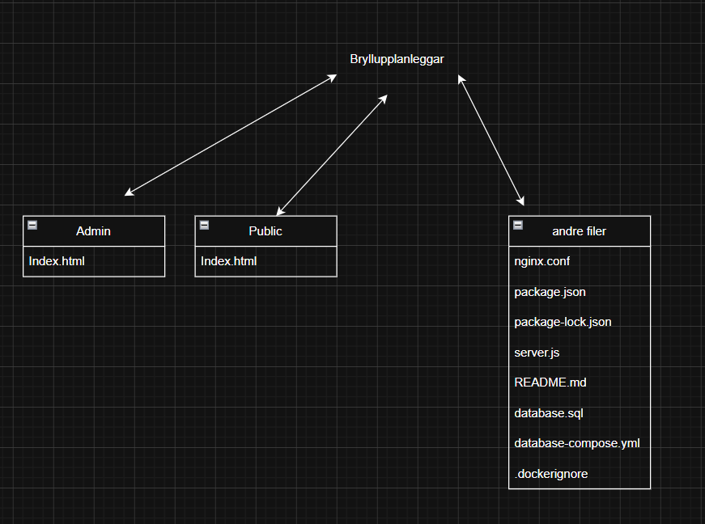

oppg. 1 Utvikling
oppsett:
kundesida - front end og produkt
admin - front end - admin redigering
database - informasjon
public - index.html
admin - index.html
ting som ikkje er tilgjengeleg frå nett docker, nginx (bannbur)

oppg. 2 Drift
brannmur - admin-grensesnittet (subnet) + ekstern trafikk
webserver og database server
arkitektur - docker containere
http://localhost/admin - lenke så kjem det opp 403 forbidden (nginx/1.31.1) - dette tyder på at nginx-s funker
http://localhost/ - lenke for dei som skal bestille

oppg. 3 Brukerstøtte
- ein må tenkje mykje på sikkerheiten og halde på personopplysningane på ein sikker måte.
brukar
registrering med e-post og passord
innlogging og utlogging
gløymt passord - funksjon
ikkje brukar profilar med namn adresse og telefon dei skal halde kontakten over epost
bestilling
handlekurv - for at dei kan tenkje igjennom
betalingsmåte (vipps, paypale)
ordrekistorikk
sikkerheit
passord skal ikkje lagras i klartkst (kryptert)
HTTPS på alt (kryptering på alt av passord, kortdata ect.)
to faktor autorisering for admin og kansje brukarane

GDPR er EU/EØS's personlov og det besttår av at ein har nokre pliktar vis ein da lagrar personopplysningar eller data frå brukare.
ting som ein må passe på:
- namn
-e-postadresse
-telefonnummer
-adresse
-betalingsinformasjon
-IP-adresse
-ordrehistorikk

pliktar:
-samtykke frå kunden
- formål bruke dataen der ein sei ein skal bruke den
-dataminimering ikkje lagre data som ikkej er viktig
-lagringstid døme: brukar er interakriv så slettes etter 3 år
-sikkerheit HTTPS

brukar rettigehitar:
få sjå all data lagra av dei
endre feil opplysningar
be om sletting av data
klaging til døme: datatilsynet

det som kan bli akktuelt når nettsiden skal vokse:
registrering med namn, epostadresse og passord med minst 8 tegn og minst ein stor bokstav og med tall og eit tein
ein får epost etter ein har logga inn for å da verifisere
så logge inn med epostadresse og passordet

handel:
bla igjennom produktane og kunen legge i handle kurv det ein har tenkt å ha
så gå til handlekurv for å sjekke alt og om du ve ha noko eller endre de
så gå til betaling så fylle ut leverings adresse og betalingsmetoden så fulføre betalinga også får ein epost at bestillinga er mottat
også sende epost om det er noko endring at ein skal ende til eposten hei@bryllup.no eller ringe nummeret 22 33 44

dokumentasjon:
funksjonalitet:

korleis starter ein programet på eigen maskin:
laste ned docker - vis du ikkje har det
laste ned prosjekt mappa og pakk ut zip-fila
åpne powershell og gå til mappa der den ligger med kode bruk (cd "plassen den ligg på pc-en)
powershell - npm install
powershell - docker compose up -d --build (vent nokre minutter)
powershell - docker compose up -d
så åpner du nettsida med:
http://localhost/
http://localhost/admin
for å stoppe nettsida - powershell: docker compse down
vis noko feil bruk: powershell: docker compose logs app eller/og docker compose log nginx

dokumentering:
-SSl-serfikat: hindret at docker ville bygge seg og halde seg oppe - løsninga var og åpne powershell og åpne notepad dockerfile sjekke om det da er noko feil der også run npm set strict ssl false og npm install
-port konflikt etter eg da hadde ein docker compose åpen etter eg hadde øvd og da måtte eg berre stenge den og åpne rektig
-docker crasher- modulen blei ikkej funne så da måtte eg re instalere den og sjekke at eg var på rektig mappe med det
-hadde feil mappe kobla til pgn øvinga frå sørav så da bytta eg i powershell med å bruke cd "så filplassen eg skulle"
-hadde feil ip adrese til dockeren på grunn av at eg hadde resarta og alt sånt og det blei kluss så da bytta eg det i ngixi.conf.

veiledningar:
claude og lærar og sensor pgn samtalen

kjelder:
https://www.datatilsynet.no/regelverk-og-verktoy/lover-og-regler/om-personopplysningsloven-og-nar-den-gjelder/

AI-bruk:
Claude
 - hjelp med å finne ut av feilane til docker
 - litt forståelse av oppgava
 - hjalp litt korles oppsettet til nettsida skulle sjå ut (body)

